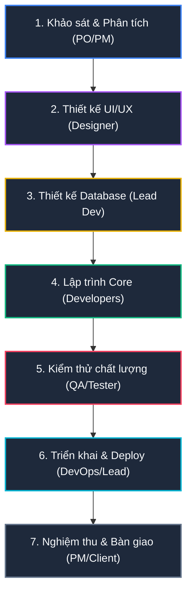

# QUY TRÌNH PHÁT TRIỂN SẢN PHẨM & VẬN HÀNH DỰ ÁN CHUẨN (CIC SOFTWARE HUB)
*Tài liệu quy trình chuẩn hóa tích hợp các công cụ số hóa, tự động hóa từ GitHub, Supabase và hệ thống quản trị dự án Trung tâm PTPM*

---

## 📅 SƠ ĐỒ TIẾN TRÌNH 7 GIAI ĐOẠN (PROJECT LIFECYCLE)

Quy trình phát triển sản phẩm của Trung tâm PTPM được quản lý tập trung qua **7 Giai đoạn nghiệp vụ**. Tiến độ của từng bước được PM điều chỉnh trực tiếp và hệ thống tự động tính toán **Tiến độ tổng thể** dựa trên trung bình cộng của cả 7 bước.

---

## 🛠️ CHI TIẾT CÔNG VIỆC, CÔNG CỤ VÀ KẾT QUẢ ĐẦU RA CHO TỪNG BƯỚC

| Giai đoạn | Vai trò chủ trì | Phần mềm & Công cụ sử dụng | Chi tiết Công việc | Kết quả đầu ra (Deliverables) |
| :--- | :--- | :--- | :--- | :--- |
| **Bước 1: Khảo sát & Phân tích** | Product Owner (PO), Project Manager (PM) | - Google Docs/Word - Google Sheets/Excel - Google AI Studio (Lên ý tưởng đặc tả) - Slack, Zoom | - Họp khởi động (Kick-off) để thống nhất tầm nhìn sản phẩm, tập người dùng và giá trị cốt lõi. - Khảo sát nghiệp vụ chi tiết: phỏng vấn người dùng cuối làm rõ các luồng tính năng thực tế. - Lập tài liệu đặc tả yêu cầu phần mềm (SRS). - Thống nhất phạm vi dự án, lập bảng phân rã công việc (WBS) và thời hạn hoàn thành. | - Tài liệu đặc tả yêu cầu phần mềm ('SRS.md' hoặc Word). - Kế hoạch tổng thể dự án ('Master_Plan.xlsx') chứa timeline và các mốc Sprint dự kiến. - Danh sách tính năng ban đầu (Product Backlog). |
| **Bước 2: Thiết kế UI/UX** | UI/UX Designer | - Figma Mockup & Prototype - Google Stich - Google AI Studio (Tạo asset & ý tưởng giao diện) | - Vẽ Wireframe (khung xương giao diện) phác thảo thô cấu trúc sắp xếp các màn hình. - Thiết kế chi tiết High-Fidelity (Mockup Figma) thể hiện chính xác 100% màu sắc HSL, font chữ, trạng thái hover/active trên các giao diện Sáng/Tối (Light/Dark Mode) và responsive Mobile. - Tạo Prototype tương tác: liên kết các màn hình Mockup Figma thành luồng bấm thử mô phỏng ứng dụng thật. - Bàn giao Design System / UI Kit (nút bấm, input, bảng màu, spacing) cho Developers. | - Link dự án Figma Mockup & Prototype có thể tương tác. - Bộ Design System & Component Library trên Figma. |
| **Bước 3: Thiết kế Database & Kiến trúc** | Lead Developer, Database Architect | - dbdiagram.io - Mermaid (vẽ ERD) - Supabase Studio / pgAdmin | - Vẽ sơ đồ quan hệ thực thể (ERD) xác định cấu trúc các bảng và mối liên kết (1-N, N-N). - Cấu hình phân quyền bảo mật cấp dòng (Row Level Security - RLS) trên cơ sở dữ liệu Supabase. - Viết các file SQL Migrations khởi tạo cấu trúc cơ sở dữ liệu (tables, views, trigger updated_at, RPC) lưu tại thư mục local. | - Sơ đồ thực thể liên kết ERD (mã Mermaid hoặc ảnh). - Thư mục chứa script SQL di cư cơ sở dữ liệu ('/supabase/migrations/') quản lý bằng Git. - Các chính sách bảo mật RLS được áp dụng trên Supabase Cloud Staging. |
| **Bước 4: Lập trình Core** | Developers (Frontend, Backend) | - VS Code / Cursor - Git / GitHub - Vite, React, Tailwind CSS - Deno CLI (Edge Functions) - Supabase JS SDK | - Setup Boilerplate mã nguồn dự án, cấu hình ESLint, Prettier, phân chia các nhánh Git ('main', 'develop', 'feat/*'). - Lập trình Frontend UI: phát triển giao diện Responsive, component dùng chung và các hiệu ứng chuyển động vi mô (Micro-animations). - Lập trình Backend: viết Deno Edge Functions trên Supabase xử lý logic nặng. - Cấu hình GitHub Webhooks trỏ về Edge Function để đồng bộ commits & PRs trực tiếp lên quản trị dự án. | - Repository mã nguồn dự án hoạt động ổn định trên GitHub. - Bản chạy thử nghiệm local (localhost) hoạt động tốt toàn bộ các tính năng cốt lõi. |
| **Bước 5: Kiểm thử chất lượng (QA/QC)** | Tester, QA Engineer | - Vitest / Jest (Automated Unit Test) - Postman (Test APIs) - GitHub Issues | - Viết Automated Unit Tests kiểm tra tự động các hàm logic nghiệp vụ lõi (hàm tính %, phân quyền...) bằng Vitest. - Kiểm thử thủ công (Manual Testing) toàn bộ luồng phần mềm, kiểm tra layout responsive đa nền tảng và kiểm thử lỗi biên. - Ghi nhận lỗi phát sinh (Bugs) lên mục GitHub Issues kèm hình ảnh, mô tả chi tiết các bước tái hiện. - Kiểm thử lại (Regression Testing) sau khi Developers khắc phục xong. | - Kịch bản kiểm thử (Test Cases document). - Bảng lỗi GitHub Issues với các lỗi nghiêm trọng đã được sửa đổi và đóng lại ('closed'). |
| **Bước 6: Triển khai & Deploy** | DevOps Engineer, Lead Developer | - Vercel / Cloudflare Pages (Frontend) - Supabase Cloud (Backend/Database) - GitHub Actions (CI/CD) | - Cấu hình deploy tự động Frontend lên Vercel / Cloudflare Pages từ nhánh Git 'main' mỗi khi gộp mã nguồn. - Đồng bộ toàn bộ SQL Migrations cấu trúc dữ liệu từ local lên Supabase Cloud Production. - Thiết lập các workflow CI/CD trên GitHub Actions tự động kiểm tra cú pháp (lint) và chạy test khi có Pull Request. | - Đường dẫn tên miền chạy chính thức hoạt động ổn định (Ví dụ: 'https://cic-erp.vercel.app/'). - File cấu hình luồng CI/CD tự động ('.github/workflows/main.yml'). |
| **Bước 7: Nghiệm thu & Bàn giao** | Project Manager (PM), Product Owner (PO), Khách hàng | - Google Drive / Docs - Sentry (Giám sát lỗi) - GitHub | - Cấp tài khoản chạy thử trên Production để khách hàng chạy nghiệm thu thực tế (UAT). - Soạn thảo tài liệu hướng dẫn sử dụng phần mềm (User Manual) và tài liệu vận hành kỹ thuật (Technical Handover). - Chuyển giao toàn quyền sở hữu các tài khoản quản lý hệ thống (Github, Supabase, Vercel) cho khách hàng và ký biên bản. | - Biên bản bàn giao & Nghiệm thu UAT có chữ ký của các bên (UAT Sign-off). - Tài liệu Hướng dẫn sử dụng chi tiết (User Manual) định dạng Markdown/PDF. |

---

## ⚡ CƠ CHẾ VẬN HÀNH & TỰ ĐỘNG HÓA SỐ HÓA (DIGITAL MANAGEMENT)

### 1. Quản lý Tiến độ Linh hoạt bằng Slider & Tự động Tính toán
* PM có quyền cập nhật tiến độ của từng bước qua **Thanh trượt (%)** hoặc nút tăng giảm nhanh **`-10`** / **`+10`** trong bảng điều khiển.
* Hệ thống sẽ tự động lấy trung bình cộng tiến trình của 7 bước để tính toán ra **Tiến độ tổng thể** của dự án thực tế theo công thức:
  $$\text{Tiến độ tổng thể} = \text{Round}\left(\frac{\sum_{i=1}^{7} \text{Tiến độ bước } i}{7}\right)$$
* Giá trị này được đồng bộ tức thì lên Supabase Cloud giúp toàn bộ đội ngũ và lãnh đạo trung tâm nắm bắt được trạng thái thời gian thực.

### 2. Tự động hóa qua GitHub Webhooks & Deno Edge Functions
* **Tự động bắt sự kiện**: Khi lập trình viên push code hoặc mở PR trên GitHub, một webhook sẽ được gửi trực tiếp đến Supabase Edge Function.
* **Xác thực an toàn**: Sử dụng giải thuật mã hóa HMAC-SHA256 để so sánh chữ ký Hex, đảm bảo dữ liệu gửi đến là chính xác từ GitHub.
* **Liên kết Task**: Webhook phân tích thông tin commit message để tự động gán, chuyển đổi trạng thái nhiệm vụ (Ví dụ: Commit chứa `fix: TASK-3` sẽ tự động chuyển trạng thái task số 3 sang mục Kiểm thử/Đã gộp).

### 3. Quản trị Nhân sự & Phân bổ Công việc
* **Thêm bớt thành viên động**: PM có thể phân bổ nhanh các lập trình viên thực tế trong trung tâm (Nguyễn Quốc Anh, Phan Thành Nam, Trần Đình Thuận) vào dự án thông qua giao diện trượt từ phải (Slide Panel).
* **Resource Workload**: Biểu đồ thanh hiển thị trực quan khối lượng công việc được giao của từng người (số việc đã làm xong trên tổng số việc) giúp PM điều chỉnh khối lượng công việc hợp lý.
* **Theo dõi hoạt động Git ở Sidebar**: Dashboard tích hợp sẵn Widget chia 2 tab **Commits** và **Pull Requests** ở cột bên phải, giúp PM theo dõi trực tiếp dòng chảy code mà không cần rời phần mềm.
