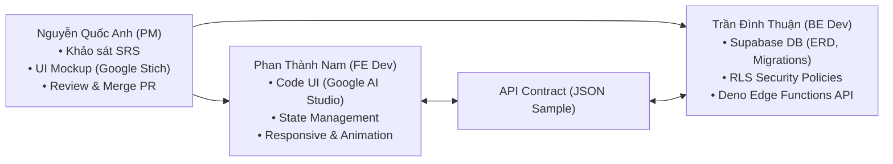
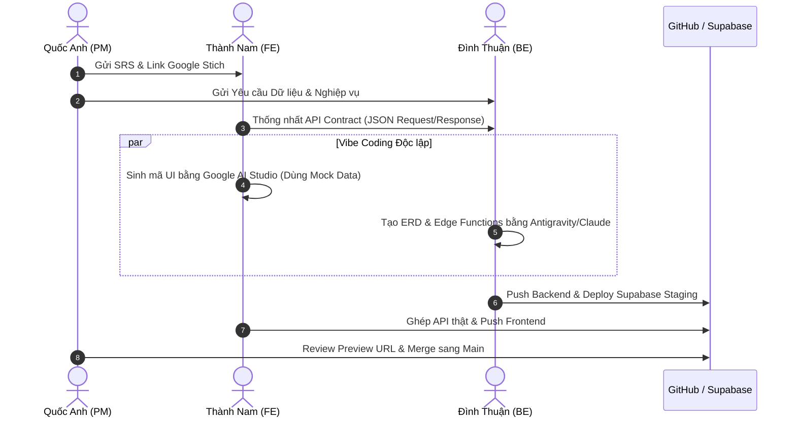

# QUY TRÌNH PHỐI HỢP VIBE CODING VỚI AI (CIC SOFTWARE HUB)
*Hướng dẫn vận hành & hợp tác giữa Project Manager (Quốc Anh) và các Lập trình viên (Phan Thành Nam & Trần Đình Thuận) khi cùng sử dụng công cụ AI (Antigravity, Google AI Studio, Claude)*

---

## 🎯 ĐẶC THÙ ĐỘI NGŨ & NGUYÊN TẮC VIBE CODING
Đội ngũ gồm **3 thành viên** hoạt động theo mô hình AI-Native Development:
* **Nguyễn Quốc Anh**: Product Owner (PO), Project Manager (PM), Solution Architect.
* **Phan Thành Nam**: Software Developer (Tập trung Frontend & UI Integration).
* **Trần Đình Thuận**: Software Developer (Tập trung Backend, Database & Infrastructure).

**Nguyên tắc Vibe Coding của đội ngũ**: *AI làm tốc độ cực nhanh, con người định hướng kiến trúc, ranh giới module rõ ràng, và kiểm soát chất lượng qua CI/CD.*

---

## 🧩 1. PHÂN BỔ RANH GIỚI NHIỆM VỤ (MODULE BOUNDARY)

Để tránh trường hợp cả 2 lập trình viên cùng dùng AI chỉnh sửa chung 1 tệp tin (gây ra Git Conflict nặng), công việc được phân chia độc lập tuyệt đối:

* **Nguyễn Quốc Anh (PO/PM)**:
  - Đóng vai trò "Kiến trúc sư trưởng" và "Người duyệt chất lượng".
  - Dùng **Google Docs/Sheets** & **Google AI Studio** lập tài liệu SRS.
  - Dùng **Google Stich** vẽ giao diện Mockup & Prototype.
  - Phê duyệt Pull Request (PR) duy nhất để gộp code vào nhánh `main`.
* **Phan Thành Nam (Frontend Developer)**:
  - Nhận bản vẽ Google Stich từ Quốc Anh, đưa vào **Google AI Studio** sinh mã React/Vite/Tailwind CSS.
  - Xây dựng giao diện tĩnh (Static UI) trước, sử dụng dữ liệu giả (Mock Data) theo đúng **API Contract**.
  - Kết nối API từ Backend khi Thuận hoàn thành.
* **Trần Đình Thuận (Backend Developer)**:
  - Nhận yêu cầu dữ liệu từ Quốc Anh & Nam, dùng **Antigravity / Claude** thiết kế ERD và SQL Migrations.
  - Thực thi bảo mật RLS trên Supabase, viết Deno Edge Functions cho các API nghiệp vụ.
  - Cung cấp API Endpoints và tài liệu Swagger/Postman cho Nam ghép nối.

---

## 🔄 2. QUY TRÌNH 4 BƯỚC PHỐI HỢP VIBE CODING HÀNG NGÀY (DAILY VIBE CYCLE)

### Bước 1: Prompt Sync & Thống nhất API Contract (15 phút đầu Sprint)
* Quốc Anh bàn giao đặc tả đặc thù dự án (SRS) và link **Google Stich**.
* Nam và Thuận cùng dùng AI Assistant thảo luận 5 phút để chốt **API Contract** (File JSON mẫu chứa tên trường dữ liệu, kiểu dữ liệu `string/number/boolean`).
* *Kết quả*: Nam có thể code UI độc lập với Mock Data, Thuận có thể code DB độc lập với API Specs.

### Bước 2: Vibe Coding Độc lập với AI (Parallel Execution)
* **Nam**: Đưa ảnh/link Google Stich vào Google AI Studio với prompt: *"Hãy chuyển giao diện này thành React Component dùng Tailwind CSS, có Mock State theo file API Contract này"*.
* **Thuận**: Sử dụng Antigravity / Claude với prompt: *"Hãy thiết kế sơ đồ ERD, tạo SQL Migration và RLS Policies trên Supabase cho các bảng dữ liệu sau..."*.

### Bước 3: Tích hợp (Integration Phase)
* Thuận deploy Edge Functions lên Supabase Staging và gửi URL API cho Nam.
* Nam chuyển đổi `isMock = true` sang gọi API thật của Thuận.
* Cả hai cùng dùng AI prompt lệnh `/debug` nếu xảy ra lỗi kết nối CORS hoặc RLS.

### Bước 4: Review & Deploy Tự động (Deployment Gate)
* Nam và Thuận mở Pull Request về nhánh `develop`.
* Vercel tự động tạo đường dẫn xem trước (**Preview URL**).
* Quốc Anh trải nghiệm trực tiếp trên Preview URL:
  - Nếu đạt 100% -> Quốc Anh bấm **Approve & Merge** vào nhánh `main`.
  - Vercel & Supabase tự động Deploy bản chính thức (Production).

---

## 🌿 3. QUY TẮC QUẢN LÝ GIT CHỐNG CONFLICT KHI VIBE CODING

Vì AI sinh ra một lượng code rất lớn trong thời gian ngắn, việc tuân thủ quy tắc Git là bắt buộc để tránh đè code của nhau:

1. **Quy tắc phân nhánh (Branching Rule)**:
   - `main`: Chỉ Quốc Anh có quyền push/merge.
   - `develop`: Nhánh tích hợp chung.
   - `feat/nam-[tên-tính-năng]`: Nhánh riêng của Nam.
   - `feat/thuan-[tên-tính-năng]`: Nhánh riêng của Thuận.
2. **Quy tắc Cấu trúc Folder**:
   - Nam chỉ làm việc trong: `/src/components/`, `/src/pages/`, `/src/hooks/`.
   - Thuận chỉ làm việc trong: `/supabase/migrations/`, `/supabase/functions/`, `/src/services/api/`.
   - *Không bao giờ hai người sửa chung 1 file cùng lúc*.
3. **Quy tắc Commit Message để kích hoạt Webhook tự động**:
   - `feat: [TASK-02] Nam hoan thein giao dien Dashboard`
   - `fix: [TASK-05] Thuan sua loi RLS truy van bang Projects`

---

## 🛠️ 4. BỘ CÔNG CỤ & PROMPT MẪU CHO ĐỘI NGŨ

### Prompt mẫu cho Nam (Frontend Vibe Coding - Google AI Studio):
> *"Tôi có bản vẽ Google Stich cho màn hình [Tên màn hình]. Hãy đóng vai Frontend Expert, viết React TypeScript Component sử dụng Tailwind CSS và Lucide Icons. Bố cục phải Responsive, hỗ trợ Dark Mode và sử dụng Mock Data theo đúng JSON Contract: [Dán JSON Contract vào đây]."*

### Prompt mẫu cho Thuận (Backend Vibe Coding - Antigravity / Claude):
> *"Tôi cần thiết kế cơ sở dữ liệu Supabase cho tính năng [Tên tính năng]. Hãy đóng vai Backend Architect, viết script SQL Migration khởi tạo bảng, thiết lập khóa ngoại, trigger updated_at tự động, và các chính sách Row Level Security (RLS) cho phép các user trong dự án được xem/sửa dữ liệu. Bổ sung 1 Deno Edge Function xử lý logic [Tên logic]."*

---

## 📈 5. KẾT QUẢ ĐẠT ĐƯỢC CỦA MÔ HÌNH PHỐI HỢP TỐI ƯU
* **Tốc độ (Speed)**: Giảm 70% thời gian trao đổi nhờ API Contract chuẩn xác từ đầu.
* **Chất lượng (Quality)**: Không bị vỡ layout hay lỗi bảo mật RLS nhờ AI kiểm tra cú pháp và Quốc Anh làm Gatekeeper.
* **Minh bạch (Transparency)**: Tiến độ của cả Nam và Thuận được đồng bộ tự động lên **Dashboard Dự án** thông qua GitHub Webhooks.
